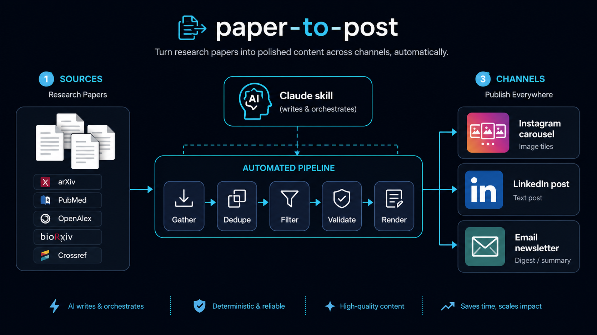

<p align="center">
  
</p>

# paper-to-post

Turn recent research papers into ready-to-publish social content across multiple
channels — **Instagram carousels, LinkedIn posts, and email-newsletter digests**.
Deterministic Python scripts do the mechanical work (gather papers, dedupe, filter,
validate, render images); a Claude Code skill orchestrates them, writes the
plain-language content, and delivers each post to the channels a topic is configured
for, via Composio.

**Everything is config-driven.** Topics, the paper sources each pulls from, and the
channels each publishes to all live in `config/topics.yml` — the pipeline is agnostic
of all three. The shipped config has two example topics you can edit or replace (each
topic's `id` is what you pass to `research-gather --topic`; its `account` selects the
card branding in `config/brand.<account>.yml`):

- `swe_ml_ai` (account `cs`) — software engineering, ML, AI, MLOps
- `bio_genetics_biomed` (account `bio`) — biology, genetics, neuroscience, biomedical

## Prerequisites

- **Python 3.12+**
- **Node.js** + the **Composio CLI** (`~/.composio/composio`) — only for the Instagram
  and LinkedIn publish steps (see "Composio setup" below). Gathering, rendering, and the
  newsletter digest run without it.
- A headless Chromium (installed via Playwright in the quickstart) for card rendering.

## Quickstart

```bash
python -m venv .venv && . .venv/bin/activate
make install
python -m playwright install chromium   # needed for rendering
cp .env.example .env                     # set CONTACT_EMAIL; API keys optional
make test
```

## Installing the skill (Claude Code & other agents)

The orchestration lives in an **[Agent Skill](https://docs.claude.com/en/docs/agents-and-tools/agent-skills)** at
`research-post-builder/` — a `SKILL.md` (name + description frontmatter, then the
workflow) plus its `references/`. The Python scripts do the deterministic work; the
skill is the instructions an agent follows to drive them. The skill is *portable* — the
`SKILL.md` format is shared across agents that support skills; only where you put it
differs.

The scripts must be runnable from this repo (`make install`, venv active) regardless of
which agent loads the skill — the skill calls the installed `research-*` commands.

### Claude Code — link it once

`.claude/` is gitignored (local state, never committed), so point Claude Code at the
skill with a symlink. Do this once per clone:

```bash
mkdir -p .claude/skills
ln -s ../../research-post-builder .claude/skills/research-post-builder
```

Then open Claude Code here and verify with `/skills` (you should see
`research-post-builder`), and trigger it: *"run the daily research posts"*.

- **Use it from anywhere** (not just this repo): install it as a personal skill —
  ```bash
  mkdir -p ~/.claude/skills
  ln -s "$(pwd)/research-post-builder" ~/.claude/skills/research-post-builder
  ```
  (Symlink, not a copy, so it stays in sync with the repo. A copy works too, but you'd
  have to re-copy after updates.) The skill still expects the repo's scripts on `PATH`
  (venv active), so run the actual posts from a shell where `make install` has been done.

### Claude Agent SDK / API

The [Agent SDK](https://docs.claude.com/en/api/agent-sdk/overview) loads skills from a
skills directory. Point it at this one — symlink or copy `research-post-builder/` into
your agent's configured skills folder (e.g. `.claude/skills/` in the SDK project, or the
path you pass to the SDK's skill loader), the same as above. The `SKILL.md` needs no
changes.

### Other agents (Codex, Gemini CLI, OpenCode, Cursor, …)

`SKILL.md` is plain Markdown with YAML frontmatter, so it's portable to any agent that
supports the skills convention — the install path is the only difference:

- **Agents that read a skills directory** (OpenCode, Codex via the skills convention):
  symlink/copy `research-post-builder/` into that agent's skills location.
- **Agents without a skills mechanism** (e.g. a bare Gemini CLI or Cursor): there's no
  auto-discovery, so paste or `@`-attach the contents of `research-post-builder/SKILL.md`
  (and the relevant `references/*.md`) into the agent's context/rules, and let it call the
  `research-*` commands. It's the same instructions; you're just supplying them manually.

Whatever the agent, the contract is identical: it reads `SKILL.md`, reads config from
`config/topics.yml`, and runs the installed `research-*` scripts from this repo.

## Composio setup (Instagram / LinkedIn publishing)

Publishing to Instagram and LinkedIn goes through Composio, so set it up once before the
first publish run. Connect each social account in your Composio account under an alias,
then reference that alias in the matching topic's `publish:` list in `config/topics.yml`
(see "Configure your own accounts"). Instagram publishing requires a professional/creator
account. (The newsletter channel needs no Composio setup — it just writes a document.)

1. **Install the Composio CLI:**

   ```bash
   curl -fsSL https://composio.dev/install | bash
   ```

2. **Log in** from your terminal:

   ```bash
   composio login
   ```

3. **Add the Composio MCP server to Claude Code:**

   ```bash
   claude mcp add --scope user --transport http composio https://connect.composio.dev/mcp
   ```

4. **Authorize it.** Open Claude Code, type `/mcp`, select **Composio**, and complete the
   browser login flow to grant access to your Composio account.

5. **Verify.** Still in `/mcp`, confirm **Composio** shows as connected in the server list.

Each publisher selects the account with Composio's `account` key and verifies the resolved
identity before posting anything — see
`research-post-builder/references/instagram-publishing.md` for the details.

## How it runs

Open Claude Code in this repo and say **"run the daily research posts"** (every enabled
topic) or scope it — **"just the CS posts"**. For each topic the skill gathers recent
papers, scores them and picks the top ~5, writes each post, validates it against the hard
gate, renders the cards (with the paper's first-page screenshot inserted near the end for
arXiv/OA papers), bundles it under `outputs/<date>/<account>/post<N>/`, and delivers to
**every channel in that topic's `publish` list** — an Instagram carousel, a LinkedIn post,
and/or an email-newsletter digest.

## Pipeline

| Stage | Command | What it does |
|---|---|---|
| Gather | `research-gather --topic <id>` | runs the topic's configured sources (arXiv, OpenAlex, Crossref, Semantic Scholar, PubMed, bioRxiv/medRxiv, industry AI labs), dedupes, and rule-filters → `candidates.json`. Reads sources from config; you don't call fetchers directly. |
| Validate | `research-validate` | hard gate — schema/hype/grounding/link/health (exit 0/1) |
| Render | `research-render`, `research-screenshot` | HTML/CSS cards at 2× (2160×2700) + gated arXiv/OA first-page screenshot |
| Bundle | `research-bundle` | ordered cards + caption; records the dedupe ledger |
| Publish — Instagram | `publish_instagram.mjs` (Composio CLI) | posts the carousel, verifying the target account first |
| Publish — LinkedIn | `publish_linkedin.mjs` (Composio CLI) | one text post per paper, verifying the member first |
| Publish — Newsletter | `research-newsletter` | one digest across the topic's posts (with subject line, inbox preheader, and a TL;DR intro) → `newsletter.md` + `newsletter.html`, ready to paste into email |

`research-gather` is the topic-agnostic front door: it reads the topic's `sources` block
and runs exactly those sources (each paginates to full window coverage; a single flaky
source is logged and skipped, not fatal). The underlying per-source fetchers
(`research-fetch-arxiv`, `-pubmed`, …) still exist as entry points but you normally don't
invoke them directly. All commands accept `--help`. Configuration lives in `config/`
(`topics.yml`, `brand.<account>.yml`); the card template is in `templates/`.

## Configure your own accounts

The two shipped topics are examples. **See [`CONFIG.md`](CONFIG.md) for the full field-by-field reference.** In short, to run your own:

1. **Edit `config/topics.yml`.** Each topic has:
   - `id`, `account` (selects branding), `display_name`, `priority`, `keywords`,
     `hard_excludes`.
   - a **`sources:`** block — only the sources you list run, each with its own params
     (arXiv `categories`, OpenAlex `subfields`, per-source `query`, `labs`, …).
   - a **`publish:`** list — one entry per channel this topic delivers to. **Volume is
     per channel:** each channel's `max_posts` decides how many of the produced posts it
     publishes. The topic gathers papers and the skill produces enough to feed the
     greediest channel; each channel then takes its own top-`max_posts` slice (omit
     `max_posts` for no cap). So Instagram can carry 5 while LinkedIn gets only the 3
     strongest and the newsletter digests 10.
     ```yaml
     publish:
       - channel: instagram
         alias: <your-composio-connection-alias>
         username: <your-ig-handle>     # verified before every upload
         max_posts: 5                   # publish up to 5 carousels
       - channel: linkedin
         alias: <your-composio-connection-alias>
         username: <your-name-or-sub>
         max_posts: 3                   # only the 3 strongest go to LinkedIn
       - channel: newsletter            # no account needed
         max_posts: 10                  # up to 10 items in the digest
         # newsletter-only display options (all optional):
         title: "<digest title>"        # default: "Research Digest"
         sort: confidence               # "position" (selection order) | "confidence"
         min_confidence: medium         # drop items below: low | medium | high
         show_why_it_matters: true      # per-item "Why it matters" line
         footer: "Forward this to a colleague."
     ```
     The newsletter options are read when the skill runs `research-newsletter --topic <id>`;
     any can be overridden per run with the matching flag (`--max-posts`, `--sort`, …).
2. **Add `config/brand.<account>.yml`** per account — palette, fonts, and `account_name`
   (the header rendered on every card). Copy an existing brand file as a starting point.
3. **Connect each social account in Composio** under the alias you set in `publish:`.

## Configuration reference

**[`CONFIG.md`](CONFIG.md) documents every field** in the files below. Summary:

- **Topics, sources & channels** — `config/topics.yml`. Each topic sets its `account`,
  `keywords`/`hard_excludes`, a `sources:` block (which sources run + their params), and a
  `publish:` list (which channels + their account aliases).
- **Branding** — `config/brand.<account>.yml`. Palette, fonts, and `account_name` (the
  header on every card).
- **Env** — `.env` (see `.env.example`). `CONTACT_EMAIL` for polite API pools, optional
  API keys, render toggles, and advisory selection knobs (`MIN_SCORE_TO_POST`, etc.).

## License

MIT — see [`LICENSE`](LICENSE). The bundled [Inter](https://github.com/rsms/inter) fonts
in `templates/fonts/` are used under the SIL Open Font License 1.1
([`templates/fonts/OFL.txt`](templates/fonts/OFL.txt)). Note that a runtime dependency,
[PyMuPDF](https://github.com/pymupdf/PyMuPDF), is licensed **AGPL-3.0**; it is used only
to rasterize a paper's first page for the optional screenshot card.
